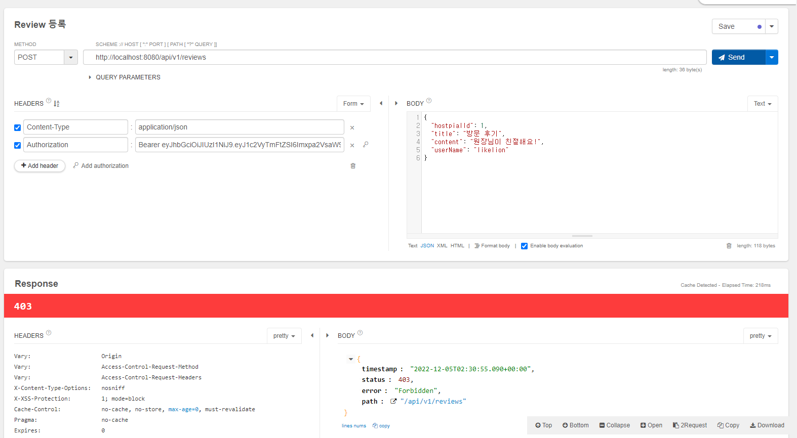
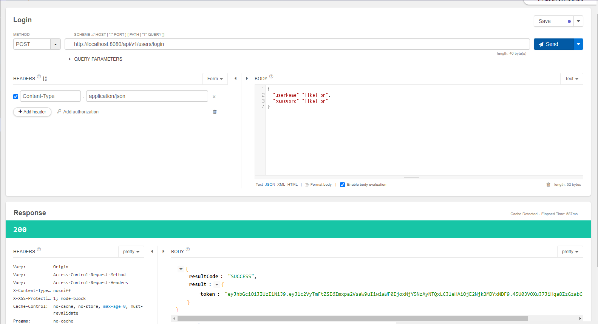
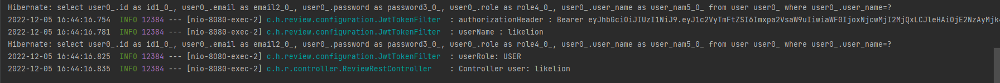

# 📌 JWT 이용하기

### JWT(JSON Web Token)란?

- 당사자 간에 정보를 JSON 형태로 안전하게 전송하기 위한 토큰

- 주로 서버와의 통신에서 권한 인가(Authorization)를 위해 사용

  

- Header (헤더)

  👉 검증과 관련된 내용을 담고 있음

  ```json
  {
      "alg" : "HS256",
      "typ" : "JWT"
  }
  ```

  👉 `alg` 속성은 해싱 알고리즘을 지정하며, 토큰을 검증할 때 사용되는 서명 부분에서 사용

  👉 `typ` 속성은 토큰의 타입을 지정

- Payload (내용)

  - 토큰에 담는 정보를 포함하며, 포함된 속성들은 클레임(Claim)이라 불림

  - Registered Claims (등록된 클레임) : 필수는 아니지만 토큰에 대한 정보를 담기 위해 이미 이름이 정해져 있는 클레임

    👉 `iss` : 발급자(issue) 주체

    👉 `sub` : JWT의 제목(Subject)

    👉 `aud` : JWT의 수신인(Audience), 요청 처리 주체가 `aud`값으로 자신을 식별하지 않으면 JWT는 거부됨

    👉 `exp` : 만료시간(Expiration), 시간은 NumericDate 형식으로 지정

    👉 `nbf` : 'Not Before'를 의미

    👉 `iat` : JWT가 발급된 시간(issued at)

    👉 `jti` : JWT의 식별자(JWT ID), 중복 처리 방지를 위해 사용

  - Public Claims (공개 클레임) : 키 값을 마음대로 정의할 수 있음. 단, 충돌이 발생하지 않을 이름으로 설정
  - Private Claims (비공개 클레임) : 통신 간에 상호 합의되고 등록된 클레임과 공개된 클레임이 아닌 클레임을 의미

- Signature(서명) 

  - 인코딩된 헤더, 인코딩된 내용, 비밀키, 헤더의 알고리즘 속성값을 가져와 생성
  - 토큰의 값들을 포함해서 암호화하기 때문에 메시지가 도중에 변경되지 않았는지 확인할 때 사용

<br />

<br />

### Spring Security 접근 권한 설정

##### Token 인증이 안된 사용자의 접근을 막기 위한 Security Config 수정

```java
package com.hospital.review.configuration;

import org.springframework.context.annotation.Bean;
import org.springframework.context.annotation.Configuration;
import org.springframework.http.HttpMethod;
import org.springframework.security.config.annotation.web.builders.HttpSecurity;
import org.springframework.security.config.annotation.web.configuration.EnableWebSecurity;
import org.springframework.security.config.http.SessionCreationPolicy;
import org.springframework.security.web.SecurityFilterChain;

@EnableWebSecurity
@Configuration
public class SecurityConfig {

    @Bean
    public SecurityFilterChain securityFilterChain(HttpSecurity httpSecurity) throws Exception {
        return httpSecurity
                .httpBasic().disable()
                .csrf().disable()
                .cors().and()
                .authorizeRequests()
                .antMatchers("/api/v1/users/join", "/api/v1/users/login").permitAll()
                .antMatchers(HttpMethod.POST, "/api/v1/**").authenticated()
                .and()
                .sessionManagement()
                .sessionCreationPolicy(SessionCreationPolicy.STATELESS)
                .and()
                .build();
    }
}
```

👉 실행 결과 - Review 등록 시도 시 403 에러 발생



👉 그러나 Join은 앞에서 `.antMatchers("/api/v1/users/join", "/api/v1/users/login").permitAll()`로 허용해주었기 때문에 200 성공



<br />

<br />

### JwtTokenFilter 구현 및 적용

**JwtTokenFilter.java**

```java
package com.hospital.review.configuration;

import com.hospital.review.domain.entity.User;
import com.hospital.review.service.UserService;
import lombok.RequiredArgsConstructor;
import org.apache.catalina.security.SecurityUtil;
import org.springframework.security.authentication.UsernamePasswordAuthenticationToken;
import org.springframework.security.core.authority.SimpleGrantedAuthority;
import org.springframework.security.core.context.SecurityContextHolder;
import org.springframework.security.web.authentication.WebAuthenticationDetails;
import org.springframework.security.web.authentication.WebAuthenticationDetailsSource;
import org.springframework.web.filter.OncePerRequestFilter;

import javax.servlet.FilterChain;
import javax.servlet.ServletException;
import javax.servlet.http.HttpServletRequest;
import javax.servlet.http.HttpServletResponse;
import java.io.IOException;
import java.util.List;

@RequiredArgsConstructor
public class JwtTokenFilter extends OncePerRequestFilter {

    private final UserService userService;
    private final String secretKey;

    @Override
    protected void doFilterInternal(HttpServletRequest request, HttpServletResponse response, FilterChain filterChain) throws ServletException, IOException {

        // 권한 부여 정하기
        UsernamePasswordAuthenticationToken authenticationToken = new UsernamePasswordAuthenticationToken("", null, List.of(new SimpleGrantedAuthority("USER")));
        authenticationToken.setDetails(new WebAuthenticationDetailsSource().buildDetails(request));
        SecurityContextHolder.getContext().setAuthentication(authenticationToken);  // 권한 부여
        filterChain.doFilter(request, response);
    }
}
```

- `OncePerRequestFilter`로부터 오버라이딩한 `doFilterInternal()`메서드 구현

  👉 JwtTokenProvider를 통해 servletRequest에서 토큰을 추출하고 토큰에 대한 유효성을 검사

  👉 유효한 토큰이라면 Authentication 객체를 생성하여 SecurityContextHolder에 추가하는 작업 수행

**SecurityConfig.java**

```java
package com.hospital.review.configuration;

import com.hospital.review.service.UserService;
import lombok.RequiredArgsConstructor;
import org.springframework.beans.factory.annotation.Value;
import org.springframework.context.annotation.Bean;
import org.springframework.context.annotation.Configuration;
import org.springframework.http.HttpMethod;
import org.springframework.security.config.annotation.web.builders.HttpSecurity;
import org.springframework.security.config.annotation.web.configuration.EnableWebSecurity;
import org.springframework.security.config.http.SessionCreationPolicy;
import org.springframework.security.web.SecurityFilterChain;
import org.springframework.security.web.authentication.UsernamePasswordAuthenticationFilter;

@EnableWebSecurity
@Configuration
@RequiredArgsConstructor
public class SecurityConfig {

    private final UserService userService;
    @Value("${jwt.token.secret}")
    private String secretKey;

    @Bean
    public SecurityFilterChain securityFilterChain(HttpSecurity httpSecurity) throws Exception {
        return httpSecurity
                .httpBasic().disable()
                .csrf().disable()
                .cors().and()
                .authorizeRequests()
                .antMatchers("/api/v1/users/join", "/api/v1/users/login").permitAll()
                .antMatchers(HttpMethod.POST, "/api/v1/**").authenticated()
                .and()
                .sessionManagement()
                .sessionCreationPolicy(SessionCreationPolicy.STATELESS)  // jwt 사용하는 경우 사용
                .and()
                .addFilterBefore(new JwtTokenFilter(userService, secretKey), UsernamePasswordAuthenticationFilter.class)
                .build();
    }
}
```

- `.addFilterBefore(new JwtTokenFilter(userService, secretKey), UsernamePasswordAuthenticationFilter.class)`

  👉 지정된 필터 앞에 커스텀 필터를 추가 (UsernamePasswordAuthenticationFilter.class)

<br />

<br />

### JWT를 언제 이용해야할까? (접근을 언제 막아야 할까?)

1️⃣ Token이 Null인 경우

2️⃣ 만료된 Token인 경우

3️⃣ 적절하지 않은 Token인 경우 (접근 권한이 적절하지 못한 경우)

**JwtTokenFilter.java**

```java
package com.hospital.review.configuration;

import com.hospital.review.domain.entity.User;
import com.hospital.review.service.UserService;
import com.hospital.review.util.JwtTokenUtil;
import lombok.RequiredArgsConstructor;
import lombok.extern.slf4j.Slf4j;
import org.springframework.http.HttpHeaders;
import org.springframework.security.authentication.UsernamePasswordAuthenticationToken;
import org.springframework.security.core.authority.SimpleGrantedAuthority;
import org.springframework.security.core.context.SecurityContextHolder;
import org.springframework.security.core.userdetails.UserDetails;
import org.springframework.security.web.authentication.WebAuthenticationDetailsSource;
import org.springframework.web.filter.OncePerRequestFilter;

import javax.servlet.FilterChain;
import javax.servlet.ServletException;
import javax.servlet.http.HttpServletRequest;
import javax.servlet.http.HttpServletResponse;
import java.io.IOException;
import java.util.List;

@RequiredArgsConstructor
@Slf4j
public class JwtTokenFilter extends OncePerRequestFilter {

    private final UserService userService;
    private final String secretKey;

    @Override
    protected void doFilterInternal(HttpServletRequest request, HttpServletResponse response, FilterChain filterChain) throws ServletException, IOException {
        final String authorizationHeader = request.getHeader(HttpHeaders.AUTHORIZATION);
        log.info("authorizationHeader : {}", authorizationHeader);
		// 1️⃣
        if(authorizationHeader == null || !authorizationHeader.startsWith("Bearer ")) {
            log.error("인증헤더가 잘못 되었습니다.");
            filterChain.doFilter(request, response);
            return;
        }

        String token;
        try {
            token = authorizationHeader.split(" ")[1];
        } catch (Exception e) {
            log.error("token 추출에 실패했습니다.");
            filterChain.doFilter(request, response);
            return;
        }

        // 2️⃣
        if(JwtTokenUtil.isExpired(token, secretKey)) {
            filterChain.doFilter(request, response);
            return;
        }

        // 3️⃣
        // Token에서 Claim에서  UserName 꺼내기
        String userName = JwtTokenUtil.getUserName(token, secretKey);
        log.info("userName : {}", userName);

        // UserDetail에서 가져오기
        User user = userService.getUserByUserName(userName);
        log.info("userRole: {}", user.getRole());

        // Role 바인딩
        UsernamePasswordAuthenticationToken authenticationToken = new UsernamePasswordAuthenticationToken(user.getUserName(), null, List.of(new SimpleGrantedAuthority(user.getRole().name())));
        authenticationToken.setDetails(new WebAuthenticationDetailsSource().buildDetails(request));
        SecurityContextHolder.getContext().setAuthentication(authenticationToken);  // 권한 부여
        filterChain.doFilter(request, response);
    }
}

```

**JwtTokenUtil.java**

```java
package com.hospital.review.util;

import io.jsonwebtoken.Claims;
import io.jsonwebtoken.Jwts;
import io.jsonwebtoken.SignatureAlgorithm;

import java.util.Date;

public class JwtTokenUtil {

    private static Claims extractClaims(String token, String key) {
        return Jwts.parser().setSigningKey(key).parseClaimsJws(token).getBody();
    }

    // 3️⃣
    public static String getUserName(String token, String secretKey) {
        return extractClaims(token, secretKey).get("userName", String.class);
    }

    // 2️⃣
    public static boolean isExpired(String token, String secretKey) {
        Date expiredDate = extractClaims(token, secretKey).getExpiration();  // expire timestamp를 return
        return expiredDate.before(new Date());  // 현재보다 전인지 check
    }

    public static String createToken(String userName, String key, long expireTimeMs) {
        Claims claims = Jwts.claims();  // 일종의 map
        claims.put("userName", userName);

        return Jwts.builder()
                .setClaims(claims)
                .setIssuedAt(new Date(System.currentTimeMillis()))
                .setExpiration(new Date(System.currentTimeMillis() + expireTimeMs))
                .signWith(SignatureAlgorithm.HS256, key) 
                .compact()
                ;
    }
}
```

- JWT Token 생성 시 필요한 것들

  👉 Claims - userName, 좌석 어디 등 인증하기 위해 필요한 덜 민감한 정보들

  👉 IssuesAt - Token 발급 시간

  👉 Expiration - Token 만료 시간

  👉 signWith - 어떤 secretKey로 서명할 것인지 (헤더의 알고리즘, 비밀키 등을 포함)

- `private static Claims extractClaims(String token, String key) {
          return Jwts.parser().setSigningKey(key).parseClaimsJws(token).getBody();
      }` 를 통해 secretKey를 가져와 인증

**User.java**

 ```java
 package com.hospital.review.domain.entity;
 
 import lombok.AllArgsConstructor;
 import lombok.Builder;
 import lombok.Getter;
 import lombok.NoArgsConstructor;
 
 import javax.persistence.*;
 
 @Entity
 @Builder
 @NoArgsConstructor
 @AllArgsConstructor
 @Getter
 public class User {
     @Id
     @GeneratedValue(strategy = GenerationType.IDENTITY)
     private Long id;
 
     @Column(unique = true)
     private String userName;
     private String password;
     private String email;
 
     // 3️⃣ 권한 Enum타입 멤버변수 추가
     @Enumerated(EnumType.STRING)
     private UserRole role;
 }
 ```

**UserRole.java**

```java
package com.hospital.review.domain.entity;

import lombok.AllArgsConstructor;
import lombok.Getter;

@AllArgsConstructor
@Getter
public enum UserRole {
    ADMIN("ADMIN"),
    USER("USER");

    private String name;
}
```

**UserService.java**

```java
package com.hospital.review.service;

import com.hospital.review.domain.dto.UserDto;
import com.hospital.review.domain.dto.UserJoinReqDto;
import com.hospital.review.domain.entity.User;
import com.hospital.review.domain.exception.ErrorCode;
import com.hospital.review.domain.exception.HospitalReviewAppException;
import com.hospital.review.repository.UserRepository;
import com.hospital.review.util.JwtTokenUtil;
import lombok.RequiredArgsConstructor;
import org.springframework.beans.factory.annotation.Value;
import org.springframework.security.crypto.bcrypt.BCryptPasswordEncoder;
import org.springframework.stereotype.Service;

@Service
@RequiredArgsConstructor
public class UserService {

    private final UserRepository userRepository;
    private final BCryptPasswordEncoder encoder;

    @Value("${jwt.token.secret}")
    private String secretKey;
    private long expireTimeMs = 1000 * 60 * 60;  // 1시간

    public UserDto join(UserJoinReqDto request) {
        userRepository.findByUserName(request.getUserName())
                .ifPresent(user -> {
                    throw new HospitalReviewAppException(ErrorCode.DUPLICATED_USER_NAME, String.format("UserName : %s", request.getUserName()));
                });

        User savedUser = userRepository.save(request.toEntity(encoder.encode(request.getPassword())));
        return UserDto.builder()
                .id(savedUser.getId())
                .userName(savedUser.getUserName())
                .email(savedUser.getEmail())
                .build();
    }

    public String login(String userName, String password) {
        // userName 있는지 확인
        User user = userRepository.findByUserName(userName)
                .orElseThrow(() -> new HospitalReviewAppException(ErrorCode.NOT_FOUND, String.format("%s와(과) 일치하는 회원이 없습니다.", userName)));

        // password가 일치하는지 확인
        if(!encoder.matches(password, user.getPassword())) {
            throw new HospitalReviewAppException(ErrorCode.INVALID_PASSWORD, "userName 또는 password가 잘못 되었습니다.");
        }

        // 2가지 확인 중 예외가 없다면 Token 발행
        return JwtTokenUtil.createToken(userName, secretKey, expireTimeMs);
    }

    // 3️⃣
    public User getUserByUserName(String userName) {
        return userRepository.findByUserName(userName)
                .orElseThrow(() -> new HospitalReviewAppException(ErrorCode.NOT_FOUND, ""));
    }
}
```

**UserController.java**

```java
package com.hospital.review.controller;

import com.hospital.review.domain.dto.ReviewCreateReq;
import lombok.extern.slf4j.Slf4j;
import org.springframework.security.core.Authentication;
import org.springframework.web.bind.annotation.PostMapping;
import org.springframework.web.bind.annotation.RequestBody;
import org.springframework.web.bind.annotation.RequestMapping;
import org.springframework.web.bind.annotation.RestController;

@RestController
@Slf4j
@RequestMapping("/api/v1/reviews")
public class ReviewRestController {

    @PostMapping
    public String write(@RequestBody ReviewCreateReq dto, Authentication authentication) {
        log.info("Controller user: {}", authentication.getName());
        return  "리뷰 등록 성공";
    }
}
```

👉 실행 결과 - 사용자의 role과 userName이 log에 잘 찍히는 것을 볼 수 있음


