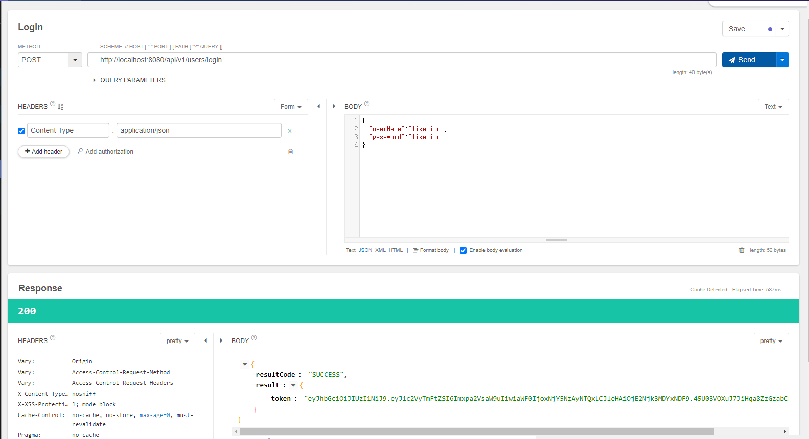

# 📌 로그인

### 로그인 실패하는 경우 예외 처리 하기

**UserRestController**

```java
package com.hospital.review.controller;

import com.hospital.review.domain.dto.*;
import com.hospital.review.domain.entity.Response;
import com.hospital.review.service.UserService;
import lombok.RequiredArgsConstructor;
import lombok.extern.slf4j.Slf4j;
import org.springframework.web.bind.annotation.PostMapping;
import org.springframework.web.bind.annotation.RequestBody;
import org.springframework.web.bind.annotation.RequestMapping;
import org.springframework.web.bind.annotation.RestController;

@RestController
@Slf4j
@RequiredArgsConstructor
@RequestMapping("/api/v1/users")
public class UserRestController {

    private final UserService userService;

    @PostMapping("/login")
    public Response<UserLoginResDto> login(@RequestBody UserLoginReqDto userLoginReqDto) {
        String token = userService.login(userLoginReqDto.getUserName(), userLoginReqDto.getPassword());
        return Response.success(new UserLoginResDto(token));
    }
}
```

- 요청 시 UserName과 Password를 받아오고, 응답 시 Token 발행

**UserService**

```java
package com.hospital.review.service;

import com.hospital.review.domain.dto.UserDto;
import com.hospital.review.domain.dto.UserJoinReqDto;
import com.hospital.review.domain.entity.User;
import com.hospital.review.domain.exception.ErrorCode;
import com.hospital.review.domain.exception.HospitalReviewAppException;
import com.hospital.review.repository.UserRepository;
import com.hospital.review.util.JwtTokenUtil;
import lombok.RequiredArgsConstructor;
import org.springframework.beans.factory.annotation.Value;
import org.springframework.security.crypto.bcrypt.BCryptPasswordEncoder;
import org.springframework.stereotype.Service;

@Service
@RequiredArgsConstructor
public class UserService {

    private final UserRepository userRepository;
    private final BCryptPasswordEncoder encoder;

    public String login(String userName, String password) {
        // userName 있는지 확인
        User user = userRepository.findByUserName(userName)
                .orElseThrow(() -> new HospitalReviewAppException(ErrorCode.NOT_FOUND, String.format("%s와(과) 일치하는 회원이 없습니다.", userName)));

        // password가 일치하는지 확인
        if(!encoder.matches(password, user.getPassword())) {
            throw new HospitalReviewAppException(ErrorCode.INVALID_PASSWORD, "userName 또는 password가 잘못 되었습니다.");
        }

        // 2가지 확인 중 예외가 없다면 Token 발행
        return "";
    }
}
```

- 로그인이 실패하는 경우는 2가지

  1️⃣ 일치하는 회원이 없는 경우

  2️⃣ 비밀번호가 일치하지 않는 경우

- **ErrorCode**는 ([Exception 처리](Exception처리.md) 참고)

**UserLoginReqDto**

```java
package com.hospital.review.domain.dto;

import lombok.AllArgsConstructor;
import lombok.Getter;
import lombok.NoArgsConstructor;

@AllArgsConstructor
@NoArgsConstructor
@Getter
public class UserLoginReqDto {
    private String userName;
    private String password;
}
```

**UserLoginResDto**

```java
package com.hospital.review.domain.dto;

import lombok.AllArgsConstructor;
import lombok.Getter;
import lombok.NoArgsConstructor;

@AllArgsConstructor
@Getter
public class UserLoginResDto {
    private String token;
}
```

<br />

<br />

### JWT 사용하여 로그인하기

build.gradle에 `jsonwebtoken 0.9.1` 라이브러리(의존성) 추가

**application.yml**

```yaml
server:
  port: 8080
  servlet:
    encoding:
      force-response: true
spring:
  datasource:
    driver-class-name: com.mysql.cj.jdbc.Driver
    url: localhost
    username: root
    password: root
  jpa:
    hibernate:
      ddl-auto: update
    show-sql: true
  mvc:
    pathmatch:
      matching-strategy: ant_path_matcher

jwt:
  token:
    secret: hello
```

- `jwt.token.secret`은 외부에 노출되면 안되는 정보이므로 의미 없는 문자열로 설정 후 Environment Variable에 `JWT_TOKEN_SECRET`에 진짜 Key값을 담아줌

**JwtTokenUtil**

```java
package com.hospital.review.util;

import io.jsonwebtoken.Claims;
import io.jsonwebtoken.Jwts;
import io.jsonwebtoken.SignatureAlgorithm;

import java.util.Date;

public class JwtTokenUtil {
    public static String createToken(String userName, String key, long expireTimeMs) {
        Claims claims = Jwts.claims();  // 일종의 map
        claims.put("userName", userName);

        return Jwts.builder()
                .setClaims(claims)
                .setIssuedAt(new Date(System.currentTimeMillis()))
                .setExpiration(new Date(System.currentTimeMillis() + expireTimeMs))
                .signWith(SignatureAlgorithm.HS256, key)
                .compact()
                ;
    }
}
```

**UserService**

```java
package com.hospital.review.service;

import com.hospital.review.domain.dto.UserDto;
import com.hospital.review.domain.dto.UserJoinReqDto;
import com.hospital.review.domain.entity.User;
import com.hospital.review.domain.exception.ErrorCode;
import com.hospital.review.domain.exception.HospitalReviewAppException;
import com.hospital.review.repository.UserRepository;
import com.hospital.review.util.JwtTokenUtil;
import lombok.RequiredArgsConstructor;
import org.springframework.beans.factory.annotation.Value;
import org.springframework.security.crypto.bcrypt.BCryptPasswordEncoder;
import org.springframework.stereotype.Service;

@Service
@RequiredArgsConstructor
public class UserService {

    private final UserRepository userRepository;
    private final BCryptPasswordEncoder encoder;

    @Value("${jwt.token.secret}")
    private String secretKey;
    private long expireTimeMs = 1000 * 60 * 60;  // 1시간

    public UserDto join(UserJoinReqDto request) {
        userRepository.findByUserName(request.getUserName())
                .ifPresent(user -> {
                    throw new HospitalReviewAppException(ErrorCode.DUPLICATED_USER_NAME, String.format("UserName : %s", request.getUserName()));
                });

        User savedUser = userRepository.save(request.toEntity(encoder.encode(request.getPassword())));
        return UserDto.builder()
                .id(savedUser.getId())
                .userName(savedUser.getUserName())
                .email(savedUser.getEmail())
                .build();
    }

    public String login(String userName, String password) {
        // userName 있는지 확인
        User user = userRepository.findByUserName(userName)
                .orElseThrow(() -> new HospitalReviewAppException(ErrorCode.NOT_FOUND, String.format("%s와(과) 일치하는 회원이 없습니다.", userName)));

        // password가 일치하는지 확인
        if(!encoder.matches(password, user.getPassword())) {
            throw new HospitalReviewAppException(ErrorCode.INVALID_PASSWORD, "userName 또는 password가 잘못 되었습니다.");
        }

        // 2가지 확인 중 예외가 없다면 Token 발행
        return JwtTokenUtil.createToken(userName, secretKey, expireTimeMs);
    }
}
```

⚠ Key 값은 절대로 소스 코드에 존재하면 안되므로 의미 없는 Key값 문자열을 대신 넣어줌

**💡 실행 결과**



👉 로그인에 성공하여 Token이 발행