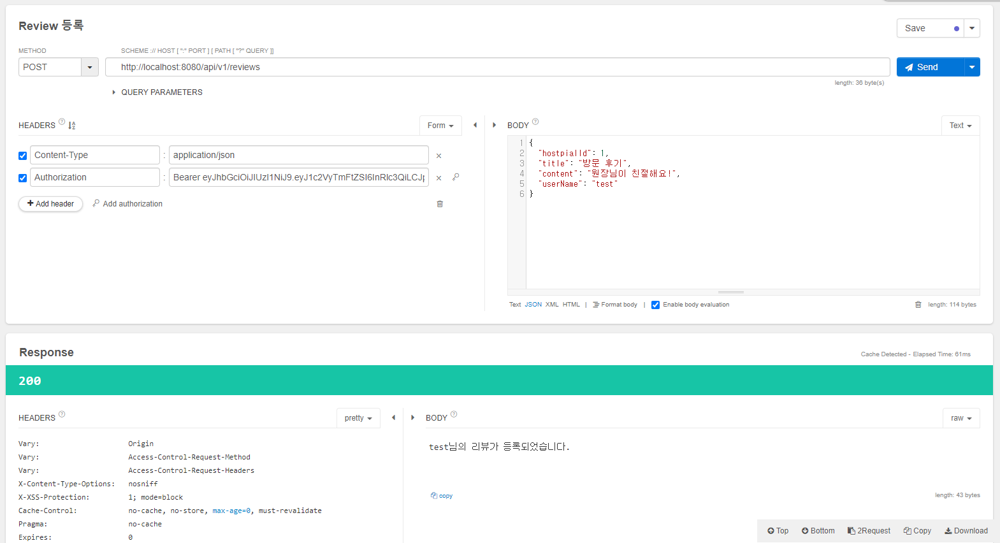

# 📌 Review 등록

### Review 등록

👉 Review 등록에 앞서 Spring Security와 JWT 사용을 위한 설정은 [JWT 이용하기](./JWT이용하기.md) 참고

**ReviewRestController.java**

```java
package com.token.authenticate.controller;

import com.token.authenticate.domain.dto.ReviewCreateReq;
import com.token.authenticate.service.ReviewService;
import lombok.RequiredArgsConstructor;
import lombok.extern.slf4j.Slf4j;
import org.springframework.http.ResponseEntity;
import org.springframework.security.core.Authentication;
import org.springframework.web.bind.annotation.PostMapping;
import org.springframework.web.bind.annotation.RequestBody;
import org.springframework.web.bind.annotation.RequestMapping;
import org.springframework.web.bind.annotation.RestController;

@RestController
@RequiredArgsConstructor
@Slf4j
@RequestMapping("/api/v1/reviews")
public class ReviewRestController {

    private final ReviewService reviewService;

    @PostMapping
    public ResponseEntity<String> write(@RequestBody ReviewCreateReq request, Authentication authentication) {
        log.info("writer : {}", authentication.getName());
        return ResponseEntity.ok()
                .body(reviewService.write(authentication.getName()));
    }
}
```

**ReviewService.java**

```java
package com.token.authenticate.service;

import lombok.RequiredArgsConstructor;
import org.springframework.stereotype.Service;

@Service
@RequiredArgsConstructor
public class ReviewService {

    public String write(String userName) {
        return userName + "님의 리뷰가 등록되었습니다.";
    }
}
```

👉 실행 결과

