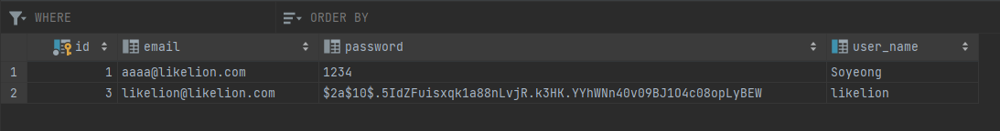

# 📌 Spring Security

### 비밀번호 암호화하여 DB 저장하기

**SecurityConfig**

```java
package com.hospital.review.configuration;

import org.springframework.context.annotation.Bean;
import org.springframework.context.annotation.Configuration;
import org.springframework.security.config.annotation.web.builders.HttpSecurity;
import org.springframework.security.config.annotation.web.configuration.EnableWebSecurity;
import org.springframework.security.config.http.SessionCreationPolicy;
import org.springframework.security.web.SecurityFilterChain;

@EnableWebSecurity
@Configuration
public class SecurityConfig {

    @Bean
    public SecurityFilterChain securityFilterChain(HttpSecurity httpSecurity) throws Exception {
        return httpSecurity
                .httpBasic().disable()
                .csrf().disable()
                .cors().and()
                .authorizeRequests()
                .antMatchers("/api/**").permitAll()
                .antMatchers("/api/v1/users/join", "/api/v1/users/login").permitAll()
                .and()
                .sessionManagement()
                .sessionCreationPolicy(SessionCreationPolicy.STATELESS)
                .and()
                .build();
    }
}
```

- 기존의 Spring Boot에서는 보안 필터체인 설정 시 `WebSecurityConfigurerAdapter`를 상속받아 설정하였지만, 지금은 Bean으로 등록하여 사용하도록 변경됨

- `.httpBasic().disable()` : 기본 설정은 비인증 시 로그인 폼 화면으로 리다이렉트 되며, Rest API이므로 기본설정을 사용하지 않기 위해 disable() 설정

- `.csrf().disable()` : 정상적인 사용자가 의도치 않은 위조요청을 보내는 것(Cross site Request forgery; csrf)로부터 보호하는 것을 사용하지 않음 

  👉 Rest API 서버는 Stateless 상태이므로 서버에 인증정보를 보관하지 않기 때문에

- `.cors()` : 교차 출처를 공유할 수 있는 구너한을 부여하도록 브라우저에 알려주는 정책(Cross-Origin Resource Sharing; CORS) 으로, 서로 다른 출처를 가진 Application이 서로의 Resource에 접근할 수 있도록 해줌
- `.authorizeRequests()` : HttpServletRequest를 이용
- `.antMatchers().permitAll()` : 특정 리소스에 대한 접근을 인증절차 없이 허용
- `.sessionManagement().sessionCreationPolicy(SessionCreationPolicy.정책상수)` 
  - `SessionCreation .ALWAYS` : 항상 세션을 생성
  - `SessionCreation.if_REQUIRED` : 필요시 생성 (기본)
  - `SessionCreation.NEVER` : 생성하지 않고, 기존 세션이 존재하면 사용
  - `SessionCreation.STATELESS` : 생성하지 않고, 기존의 세션도 사용하지 않음

**EncrypterConfig**

```java
package com.hospital.review.configuration;

import org.springframework.context.annotation.Bean;
import org.springframework.context.annotation.Configuration;
import org.springframework.security.config.annotation.web.configuration.EnableWebSecurity;
import org.springframework.security.crypto.bcrypt.BCryptPasswordEncoder;

@Configuration
@EnableWebSecurity
public class EncrypterConfig {

    @Bean
    public BCryptPasswordEncoder encodePwd() {
        return new BCryptPasswordEncoder();  // password를 인코딩 해줄때 쓰기 위함
    }
}
```

- 비밀번호 암호화하는 메서드
  - `BCryptPasswordEncoder` : 스프링 시큐리티에서 기본적으로 사용하는 암호화 방식으로 암호화가 될때마다 새로운 값을 생성, 임의적인 값을 추가해서 암호화하지 않아도 됨
  - `StandardPasswordEncoder` : SHA-256 암호화 사용
  - `NoOpPasswordEncoder` : 암호화를 사용하지 않을 때 사용 

**💡 실행 결과**

