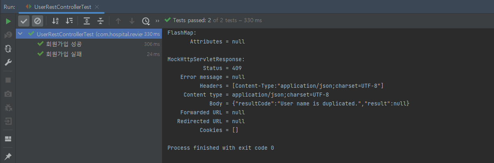

# 📌 UserRestController Test

### 회원 가입 성공 / 실패 테스트

```java
package com.hospital.review.controller;

import com.fasterxml.jackson.databind.ObjectMapper;
import com.hospital.review.domain.dto.UserDto;
import com.hospital.review.domain.dto.UserJoinReqDto;
import com.hospital.review.domain.exception.ErrorCode;
import com.hospital.review.domain.exception.HospitalReviewAppException;
import com.hospital.review.service.UserService;
import org.junit.jupiter.api.DisplayName;
import org.junit.jupiter.api.Test;
import org.springframework.beans.factory.annotation.Autowired;
import org.springframework.boot.test.autoconfigure.web.servlet.WebMvcTest;
import org.springframework.boot.test.mock.mockito.MockBean;
import org.springframework.http.MediaType;
import org.springframework.test.web.servlet.MockMvc;

import static org.mockito.ArgumentMatchers.any;
import static org.mockito.Mockito.mock;
import static org.mockito.Mockito.when;
import static org.springframework.test.web.servlet.request.MockMvcRequestBuilders.post;
import static org.springframework.test.web.servlet.result.MockMvcResultHandlers.print;
import static org.springframework.test.web.servlet.result.MockMvcResultMatchers.status;

@WebMvcTest
class UserRestControllerTest {

    @Autowired
    MockMvc mockMvc;

    @MockBean
    UserService userService;

    @Autowired
    ObjectMapper objectMapper;

    @Test
    @DisplayName("회원가입 성공")
    void join_success() throws Exception {
        UserJoinReqDto userJoinReqDto = UserJoinReqDto.builder()
                .userName("Soyeong")
                .password("1234")
                .email("aaaa@likelion.com")
                .build();

        when(userService.join(any())).thenReturn(mock(UserDto.class));

        mockMvc.perform(post("/api/v1/users/join")
                .contentType(MediaType.APPLICATION_JSON)
                .content(objectMapper.writeValueAsBytes(userJoinReqDto)))
                .andDo(print())
                .andExpect(status().isOk());
    }

    @Test
    @DisplayName("회원가입 실패")
    void join_fail() throws Exception {
        UserJoinReqDto userJoinReqDto = UserJoinReqDto.builder()
                .userName("Soyeong")
                .password("1234")
                .email("aaaa@likelion.com")
                .build();

        when(userService.join(any())).thenThrow(new HospitalReviewAppException(ErrorCode.DUPLICATED_USER_NAME, ""));

        mockMvc.perform(post("/api/v1/users/join")
                        .contentType(MediaType.APPLICATION_JSON)
                        .content(objectMapper.writeValueAsBytes(userJoinReqDto)))
                .andDo(print())
                .andExpect(status().isConflict());
    }

}
```

- when() 메서드를 통해 회원 가입을 시도했을 때의 임의의 결과를 정하여 테스트 (Stubbing, 스터빙)

  👉 회원 가입 성공 시 : Mock()을 이용한 userDto (가짜) 클래스를 임의의 리턴값으로 정함

  👉 회원 가입 실 패 시: HospitalReviewAppException로 예외를 던짐

**실행 결과**



<br />

### Spring Security 적용 후 UserRestControllerTest Refactoring

build.gradle 에 `implementation 'org.springframework.security:spring-security-test'` 라이브러리 추가

```java
package com.hospital.review.controller;

import com.fasterxml.jackson.databind.ObjectMapper;
import com.hospital.review.domain.dto.UserDto;
import com.hospital.review.domain.dto.UserJoinReqDto;
import com.hospital.review.domain.exception.ErrorCode;
import com.hospital.review.domain.exception.HospitalReviewAppException;
import com.hospital.review.service.UserService;
import org.junit.jupiter.api.DisplayName;
import org.junit.jupiter.api.Test;
import org.springframework.beans.factory.annotation.Autowired;
import org.springframework.boot.test.autoconfigure.web.servlet.WebMvcTest;
import org.springframework.boot.test.mock.mockito.MockBean;
import org.springframework.http.MediaType;
import org.springframework.security.test.context.support.WithMockUser;
import org.springframework.test.web.servlet.MockMvc;

import static org.mockito.ArgumentMatchers.any;
import static org.mockito.Mockito.mock;
import static org.mockito.Mockito.when;
import static org.springframework.security.test.web.servlet.request.SecurityMockMvcRequestPostProcessors.csrf;
import static org.springframework.test.web.servlet.request.MockMvcRequestBuilders.post;
import static org.springframework.test.web.servlet.result.MockMvcResultHandlers.print;
import static org.springframework.test.web.servlet.result.MockMvcResultMatchers.status;

@WebMvcTest
class UserRestControllerTest {

    @Autowired
    MockMvc mockMvc;

    @MockBean
    UserService userService;

    @Autowired
    ObjectMapper objectMapper;

    @Test
    @DisplayName("회원가입 성공")
    @WithMockUser
    void join_success() throws Exception {
        UserJoinReqDto userJoinReqDto = UserJoinReqDto.builder()
                .userName("Soyeong")
                .password("1234")
                .email("aaaa@likelion.com")
                .build();

        when(userService.join(any())).thenReturn(mock(UserDto.class));

        mockMvc.perform(post("/api/v1/users/join")
                .with(csrf())
                .contentType(MediaType.APPLICATION_JSON)
                .content(objectMapper.writeValueAsBytes(userJoinReqDto)))
                .andDo(print())
                .andExpect(status().isOk());
    }

    @Test
    @DisplayName("회원가입 실패")
    @WithMockUser
    void join_fail() throws Exception {
        UserJoinReqDto userJoinReqDto = UserJoinReqDto.builder()
                .userName("Soyeong")
                .password("1234")
                .email("aaaa@likelion.com")
                .build();

        when(userService.join(any())).thenThrow(new HospitalReviewAppException(ErrorCode.DUPLICATED_USER_NAME, ""));

        mockMvc.perform(post("/api/v1/users/join")
                        .with(csrf())
                        .contentType(MediaType.APPLICATION_JSON)
                        .content(objectMapper.writeValueAsBytes(userJoinReqDto)))
                .andDo(print())
                .andExpect(status().isConflict());
    }

}
```

- `@WebMvcTest`에서 요청을 할 때 401 Unauthorized 에러 발생 👉 `@WithMockUser`를 선언하여 권한을 같이 넘겨주어
- `@WithMockUser`를 사용한 후  403 Forbidden 에러 발생 👉 `.wth(csrf())` 추가