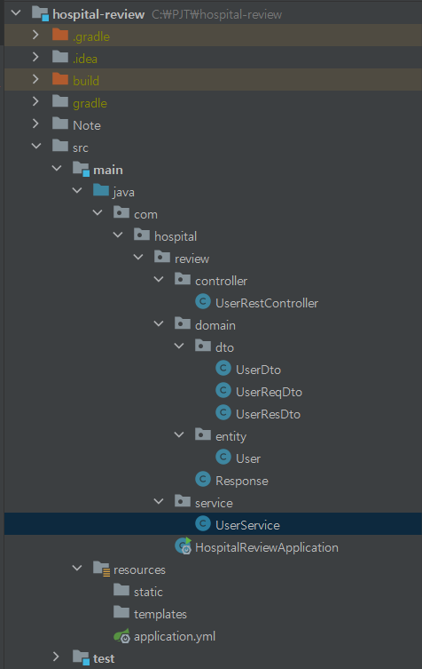
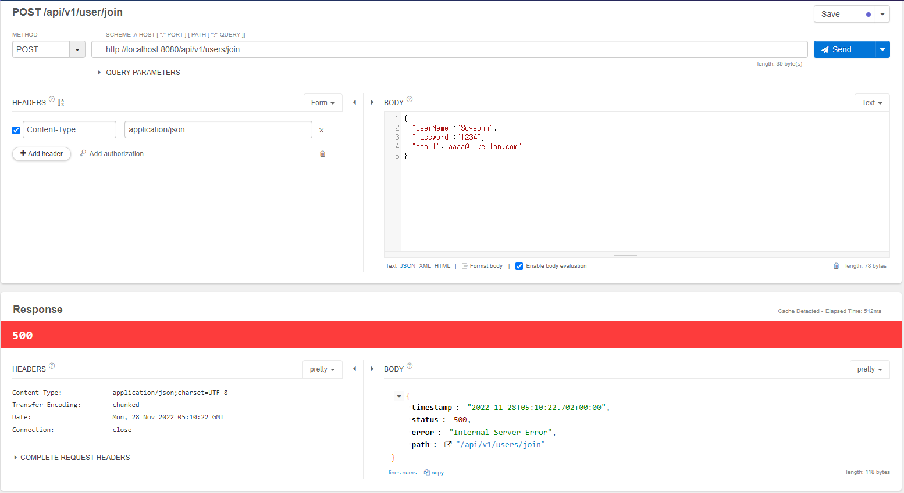
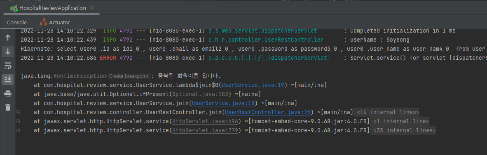

### 📌 회원 가입

#### 프로젝트 구조




#### 회원 UserName 중복 체크하기

**UserRestController**

```java
package com.hospital.review.controller;

import com.hospital.review.domain.Response;
import com.hospital.review.domain.dto.UserDto;
import com.hospital.review.domain.dto.UserReqDto;
import com.hospital.review.domain.dto.UserResDto;
import com.hospital.review.service.UserService;
import lombok.RequiredArgsConstructor;
import lombok.extern.slf4j.Slf4j;
import org.springframework.web.bind.annotation.PostMapping;
import org.springframework.web.bind.annotation.RequestBody;
import org.springframework.web.bind.annotation.RequestMapping;
import org.springframework.web.bind.annotation.RestController;

@RestController
@Slf4j
@RequiredArgsConstructor
@RequestMapping("/api/v1/users")
public class UserRestController {

    private final UserService userService;

    @PostMapping("/join")
    public Response<UserResDto> join(@RequestBody UserReqDto userReqDto) {
        log.info("userName : {}", userReqDto.getUserName());
        UserDto userDto = userService.join(userReqDto);
        return Response.success(new UserResDto(userDto.getUserName(), userDto.getEmail()));
    }
}
```

**Response**

```java
package com.hospital.review.domain.entity;

import lombok.AllArgsConstructor;
import lombok.Getter;

@AllArgsConstructor
@Getter
public class Response<T> {
    private String resultCode;
    private T result;

    public static Response<Void> error(String resultCode) {
        return new Response(resultCode, null);
    }

    public static <T> Response<T> success(T result) {
        return new Response("SUCCESS", result);
    }
}
```

**User**

```java
package com.hospital.review.domain.entity;

import lombok.AllArgsConstructor;
import lombok.Builder;
import lombok.Getter;
import lombok.NoArgsConstructor;

import javax.persistence.*;

@Entity
@Builder
@NoArgsConstructor
@AllArgsConstructor
@Getter
public class User {
    @Id
    @GeneratedValue(strategy = GenerationType.IDENTITY)
    private Long id;

    @Column(unique = true)
    private String userName;
    private String password;
    private String email;
}
```

- userName에 Unique Key 설정을 해주어 데이터가 중복이 불가능하도록 함

**UserReqDto**

```java
package com.hospital.review.domain.dto;

import com.hospital.review.domain.entity.User;
import lombok.AllArgsConstructor;
import lombok.Builder;
import lombok.Getter;
import lombok.NoArgsConstructor;

@Builder
@AllArgsConstructor
@NoArgsConstructor
@Getter
public class UserReqDto {
    private String userName;
    private String password;
    private String email;

    public User toEntity(String password) {
        return User.builder()
                .userName(this.userName)
                .password(password)
                .email(this.email)
                .build();
    }
}
```

**UserResDto**

```java
package com.hospital.review.domain.dto;

import lombok.AllArgsConstructor;
import lombok.Getter;
import lombok.NoArgsConstructor;

@NoArgsConstructor
@AllArgsConstructor
@Getter
public class UserResDto {
    private String userName;
    private String email;
}

```

**UserService**

```java
package com.hospital.review.service;

import com.hospital.review.domain.dto.UserDto;
import com.hospital.review.domain.dto.UserReqDto;
import com.hospital.review.domain.entity.User;
import com.hospital.review.repository.UserRepository;
import lombok.RequiredArgsConstructor;
import org.springframework.stereotype.Service;

@Service
@RequiredArgsConstructor
public class UserService {

    private final UserRepository userRepository;

    public UserDto join(UserReqDto request) {
        userRepository.findByUserName(request.getUserName())
                .ifPresent(user -> {
                    throw new HospitalReviewAppException(ErrorCode.DUPLICATED_USER_NAME, String.format("UserName : %s", request.getUserName()));
                });

        User savedUser = userRepository.save(request.toEntity(encoder.encode(request.getPassword())));
        return UserDto.builder()
                .id(savedUser.getId())
                .userName(savedUser.getUserName())
                .email(savedUser.getEmail())
                .build();
    }
}
```

- 회원가입 비즈니스 로직

- 회원의 userName이 중복되는지 중복 Check를 진행

- 중복될 경우 Exception이 발생하도록 구현

- `.ifPresent()` : Optional 객체가 값을 가지고 있을 경우 실행 값이 있다면 예외 처리

  👉 만약 중복된 이름으로 회원가입을 시도한다면 서버에서는 500번 에러가 발생하고 에러코드와 요청한 회원의 이름을 HospitalReviewAppException으로 넘겨줌





👉 이때 사용자 입장에서는 어떤 문제가 있는지 알 수 없기 때문에 Exception 발생 시 문제가 발생한 이유를 알 수 있도록 해야 함 ([Exception 처리 참고](./Exception처리.md))

- UserRepository를 이용하여 데이터를 저장하기 전, ResponseDto를 Entity 객체로 변환할 때 비밀번호를 암호화하여 저장 ([SpringSecurity 참고](./SpringSecurity.md)) 

